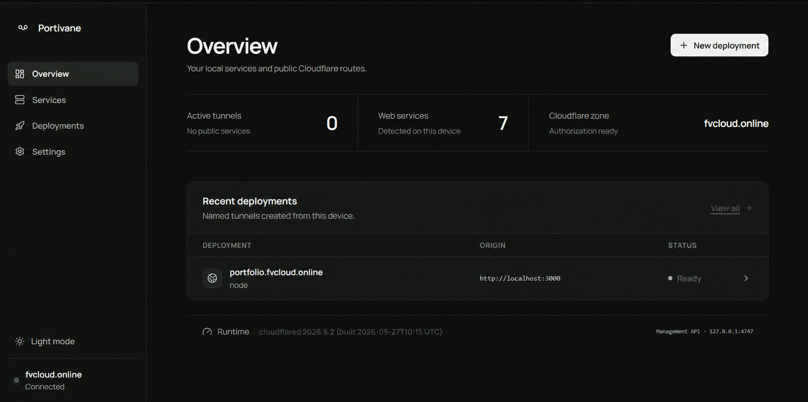
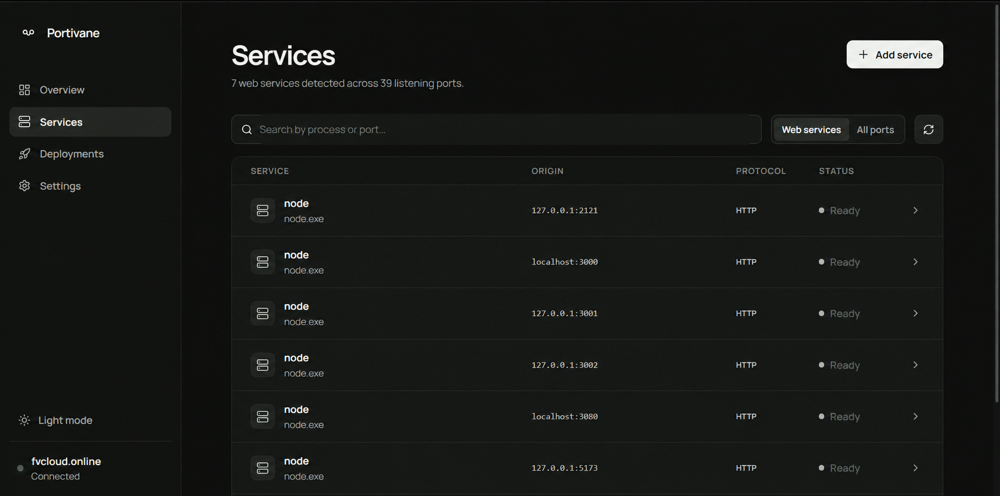
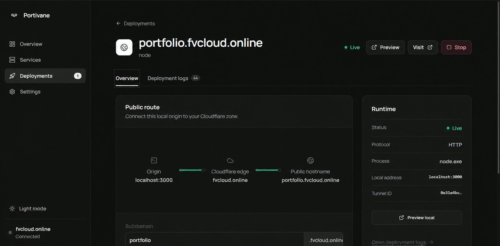

# Portivane

<p align="center">
  
</p>

<p align="center">
  <strong>Publish local services securely.</strong><br>
  Discover your running services, pick a subdomain, and publish securely — no router config, no port forwarding.
</p>

<p align="center">
  <a href="https://github.com/cyrstrstn/Portivane/actions/workflows/release.yml"></a>
  <a href="https://github.com/cyrstrstn/Portivane/releases/latest"></a>
  
</p>

---

## Screenshots

| Overview | Services |
|---|---|
|  |  |

| Live deployment |
|---|
|  |

---

## What it does

- **Detects** every HTTP/HTTPS service listening on your machine — including IPv6-only servers — and shows them in a clean list.
- **One-click install** for `cloudflared` if it's not already on your system. No terminal required.
- **Publishes** a local service to a public Cloudflare hostname in three steps: pick a service, enter a subdomain, click Deploy.
- **Live deploy logs** stream in real time as the tunnel connects, scoped per service — no stale logs from other deployments.
- **Preview** buttons open your local service or public URL directly from the dashboard.
- **Stop, restart, or delete** any deployment safely. Deletion removes only the DNS record and tunnel that Portivane created.
- **Dark and light** themes. Persistent across sessions.

---

## Installation

### Windows

1. Download `portivane-windows-amd64.zip` from [Releases](https://github.com/cyrstrstn/Portivane/releases).
2. Extract and run `portivane.exe`. Your browser opens `http://127.0.0.1:4747`.
3. If `cloudflared` is not installed, Portivane shows an **Install cloudflared** button — one click handles it.
4. Click **Connect Cloudflare** and complete the browser authorization.

### macOS

1. Download the DMG for your Mac: `amd64` for Intel, `arm64` for Apple Silicon.
2. Open `Portivane.app` from the DMG.
3. Use the in-app install button for `cloudflared`, or install manually:
   ```bash
   brew install cloudflared
   ```

### Linux

```bash
# Debian/Ubuntu
sudo dpkg -i portivane-linux-amd64.deb
portivane
```

For the tarball, extract the binary, make it executable, and run it. Use `PORTIVANE_NO_BROWSER=1` on headless machines.

#### Run as a service

On a Linux server, install the binary and enable the included systemd unit:

```bash
sudo bash packaging/linux/install-service.sh /path/to/portivane
```

Portivane starts on boot and remains running after the SSH session closes. Open `http://127.0.0.1:4747` through an SSH tunnel, or explicitly bind a private interface with `PORTIVANE_LISTEN=0.0.0.0:4747` and `PORTIVANE_ALLOW_NETWORK=1`. The first visit creates the local password; all later dashboard and API requests require it.

On Windows, run `packaging/windows/install-service.ps1` as Administrator to register an automatic service. `packaging/windows/portivane-tray.ps1` provides an optional notification-area launcher with an Open and Exit menu.

### Access protection

Portivane is loopback-only by default. If you intentionally expose it on a LAN, set `PORTIVANE_ALLOW_NETWORK=1`; the first-run password screen then protects the dashboard and API. Password material is stored as a salted, iterated hash in the per-user Portivane state file and is never sent to Cloudflare.

---

## First tunnel

1. Start your local app and confirm it loads at e.g. `http://localhost:3000`.
2. Open Portivane at `http://127.0.0.1:4747`.
3. Install `cloudflared` if prompted (one click).
4. Click **Connect Cloudflare** and authorize the zone you want to use.
5. Go to **Services**, find your app, and click it.
6. Enter a subdomain — e.g. `photos` for `photos.example.com`.
7. Click **Deploy service**. Portivane creates the tunnel, adds the DNS record, and streams the connection logs.
8. Once the status shows **Live**, your service is publicly reachable.

---

## Requirements

- **Cloudflare is required for public deployments.** Portivane is an operator UI for Cloudflare Tunnel; it does not provide an independent tunneling or relay service.
- A Cloudflare account with at least one domain managed by Cloudflare DNS.
- The official `cloudflared` client — Portivane can install this for you automatically.

Without Cloudflare authorization and `cloudflared`, Portivane can still show local services, but it cannot create public hostnames or publish traffic.

---

## Build from source

```bash
git clone https://github.com/cyrstrstn/Portivane.git
cd Portivane
npm --prefix web ci
npm --prefix web run build
go test ./...
go build -trimpath -o portivane .
```

Run `.\portivane.exe` (Windows) or `./portivane` (macOS/Linux), then open `http://127.0.0.1:4747`.

---

## How it works

Portivane uses Cloudflare's locally-managed tunnel flow:

1. `cloudflared tunnel login` — authorizes a zone, stores credentials locally.
2. Portivane reads the zone certificate in memory to display the domain and check DNS. The API token is never sent to the browser.
3. `cloudflared tunnel create` — creates a named tunnel.
4. `cloudflared tunnel route dns` — maps the chosen hostname to the tunnel.
5. Portivane writes a private connector config and starts `cloudflared tunnel run`.

Logs from the connector are streamed live and stored per-service, so switching between deployments always shows the correct output.

---

## Security

- The UI and API bind to loopback only (`127.0.0.1:4747`).
- Mutating API calls require Portivane's local request header.
- Cloudflare credentials stay in the standard `.cloudflared` directory and are never exposed to the browser.
- Portivane does not persist the Cloudflare API token.

---

> Portivane is an independent project and is not affiliated with or endorsed by Cloudflare, Inc.
